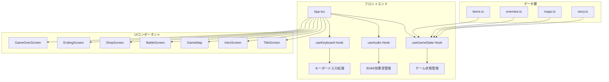
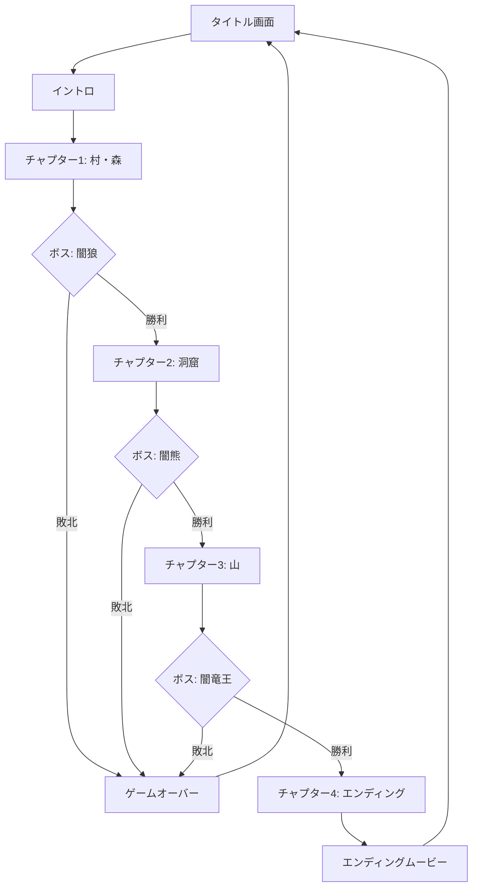
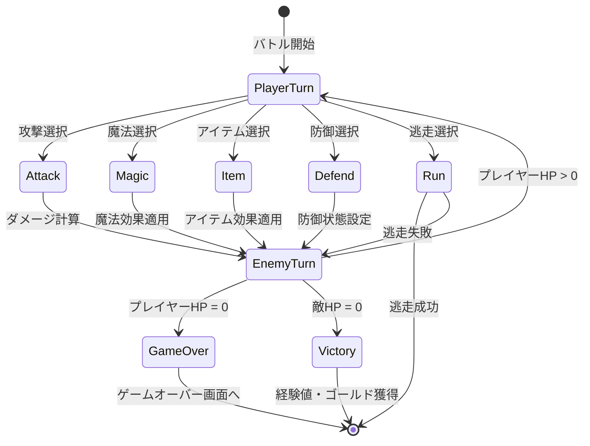
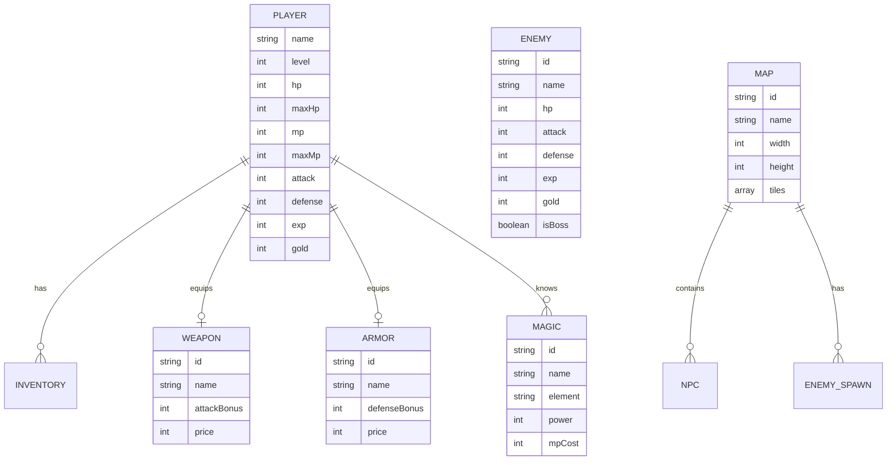
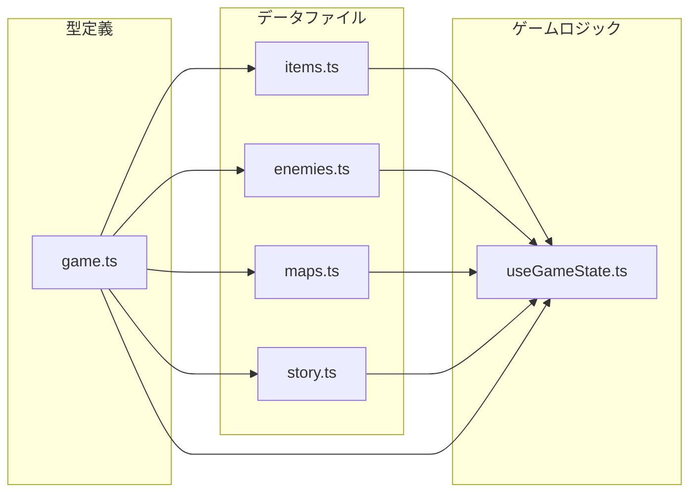
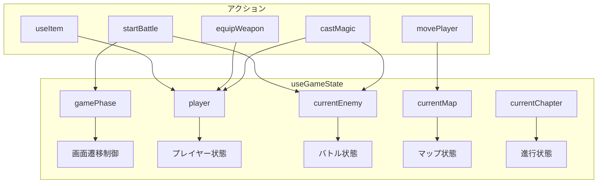

# AIアシスタント「Devin」でアクションRPGゲームを開発した記録

## はじめに

本記事では、AIソフトウェアエンジニアリングアシスタント「Devin」を活用して、ファイナルファンタジーやドラゴンクエストに着想を得たアクションRPGゲーム「猫勇者の冒険」を開発した過程を記録いたします。プロンプトの設計から実装、テスト、品質管理に至るまでの一連の流れを詳細に解説いたします。

## 開発の概要

### プロジェクト情報

| 項目 | 内容 |
|------|------|
| プロジェクト名 | 猫勇者の冒険（Cat Hero's Adventure） |
| 技術スタック | React 18, TypeScript, Vite, Tailwind CSS |
| テストフレームワーク | Vitest |
| リポジトリ | [ai-dev013/devin](https://github.com/ai-dev013/devin) |

## 指示したプロンプト

### 第1回プロンプト：ゲーム本体の開発

```
あなたは優秀なデザイナー、システムエンジニアです
Webアプリケーションを作成し完成した成果物をGithubの[ai-dev013/devin]リポジトリにプッシュしてください

## Webアプリの仕様
– アクションRPGのゲームをWebアプリで作成してください
– 主人公のキャラクタ（猫型）が、敵（さまざまな動物）キャラクタを倒してゴールを目指します
  主人公はHPが100%で開始し、0%になるとゲームオーバー
– ファイナルファンタジーやドラゴンクエストに似たストーリー展開やアイテム、武器、魔法を実現してください
– 30分程度でエンディングまで遊べる長さを作ってください
– ゲーム中はゲームににあった音楽を流し、敵と戦うときは効果音を鳴らしてください
– ゲームクリア時はエンディングミュービーを再生してください

## 開発について
– スムーズに開発が進むように進捗を管理してください
– 品質向上のため生成物を作成するたびに、レビューを行い不具合は早期に回収してください
– 単体テスト、結合テスト、総合テストを実施してください
```

### 第2回プロンプト：テストと実行手順の追加

```
自動テストを行ってください
また、ローカルPCで実行するにはどうしたら手順を教えてください
```

## システム設計

### 全体アーキテクチャ

本ゲームは、Reactをベースとしたシングルページアプリケーションとして設計いたしました。以下に全体のアーキテクチャを示します。



### ゲームフロー

ゲームの進行フローを以下に示します。プレイヤーは村からスタートし、4つのチャプターを経てエンディングに到達いたします。



### バトルシステム

ターン制バトルシステムの状態遷移を以下に示します。



### データ構造

ゲーム内のデータ構造を以下のER図で示します。



## 開発の流れ

### 開発プロセス

Devinは以下の手順で開発を進めました。

```mermaid
gantt
    title 開発タイムライン
    dateFormat  HH:mm
    section 準備
    リポジトリクローン・ブランチ作成    :done, 00:00, 5m
    section 設計
    ゲーム設計・計画                    :done, 00:05, 15m
    section 実装
    プロジェクト作成                    :done, 00:20, 10m
    ゲームエンジン実装                  :done, 00:30, 30m
    UIコンポーネント実装                :done, 01:00, 40m
    エンディング実装                    :done, 01:40, 15m
    section 統合
    App.tsx統合                         :done, 01:55, 10m
    TypeScriptエラー修正                :done, 02:05, 15m
    section テスト
    ローカルテスト                      :done, 02:20, 10m
    自動テスト作成                      :done, 02:30, 30m
    section 完了
    PR作成・更新                        :done, 03:00, 10m
```



### 実装したコンポーネント一覧

| カテゴリ | コンポーネント | 説明 |
|----------|----------------|------|
| 画面 | TitleScreen | タイトル画面、ゲーム開始 |
| 画面 | IntroScreen | オープニングストーリー |
| 画面 | GameMap | マップ探索画面 |
| 画面 | BattleScreen | バトル画面 |
| 画面 | ShopScreen | ショップ画面 |
| 画面 | EndingScreen | エンディングムービー |
| 画面 | GameOverScreen | ゲームオーバー画面 |
| UI | StatusPanel | ステータス表示 |
| UI | DialogueBox | 会話ウィンドウ |
| UI | GameMenu | メニュー画面 |
| UI | ControlsHelp | 操作説明 |
| Hook | useGameState | ゲーム状態管理 |
| Hook | useAudio | 音声管理 |
| Hook | useKeyboard | キーボード入力 |

## 工夫した点

### 1. データ駆動設計

ゲームデータを外部ファイルに分離し、拡張性と保守性を高めました。



アイテム、敵、マップ、ストーリーをそれぞれ独立したデータファイルとして管理することで、ゲームバランスの調整やコンテンツの追加が容易になりました。

### 2. 包括的なテスト戦略

3層のテスト構造を採用し、品質を担保いたしました。

```mermaid
pyramid
    title テストピラミッド
    "E2Eテスト (42件)" : 42
    "結合テスト (20件)" : 20
    "単体テスト (27件)" : 27
```

| テスト種別 | テスト数 | 対象 |
|------------|----------|------|
| 単体テスト | 27件 | ゲームデータ検証、戦闘計算、レベルアップシステム |
| 結合テスト | 20件 | インベントリ、装備、戦闘、魔法、ショップシステム |
| E2Eテスト | 42件 | ゲームフロー、チャプター進行、データ整合性 |

### 3. 状態管理の一元化

カスタムフック `useGameState` により、ゲーム状態を一元管理いたしました。



### 4. レスポンシブなUI設計

Tailwind CSSを活用し、様々な画面サイズに対応するUIを実現いたしました。shadcn/uiコンポーネントを基盤として、一貫性のあるデザインシステムを構築いたしました。

### 5. キーボード操作の最適化

RPGゲームに適したキーボード操作を実装いたしました。

| キー | 機能 |
|------|------|
| W/A/S/D または 矢印キー | 移動 |
| Enter/Space | 決定・インタラクション |
| ESC | メニュー表示 |
| Backspace | キャンセル |

## テスト結果

自動テストの実行結果は以下の通りです。

```
 Test Files  3 passed (3)
      Tests  89 passed (89)
   Start at  09:36:29
   Duration  894ms
```

全89件のテストが正常に通過いたしました。

## ローカル実行手順

### 前提条件

- Node.js 18以上
- npm または yarn

### インストールと実行

```bash
# リポジトリをクローン
git clone https://github.com/ai-dev013/devin.git
cd devin

# PRのブランチに切り替え
git checkout devin/1769677511-action-rpg-game

# ゲームディレクトリに移動
cd cat-rpg-game

# 依存関係をインストール
npm install

# 開発サーバーを起動
npm run dev

# テストを実行
npm run test
```

ゲームは `http://localhost:5173` でプレイできます。

## まとめ

AIアシスタント「Devin」を活用することで、以下の成果を得ることができました。

1. **効率的な開発**: プロンプトによる指示から、設計・実装・テストまでを一貫して実行
2. **品質の担保**: 89件の自動テストにより、ゲームロジックの正確性を検証
3. **保守性の高いコード**: データ駆動設計とTypeScriptによる型安全性の確保
4. **完成度の高いゲーム**: ストーリー、バトル、ショップ、レベルアップなど、RPGの基本要素を網羅

Devinは、複雑なWebアプリケーションの開発においても、設計から実装、テストまでを効果的に支援できることが確認できました。

## 参考リンク

- [GitHub リポジトリ](https://github.com/ai-dev013/devin)
- [Pull Request](https://github.com/ai-dev013/devin/pull/1)
- [Devin セッション](https://app.devin.ai/sessions/7460e6877b074d0997734e654e5bd919)
